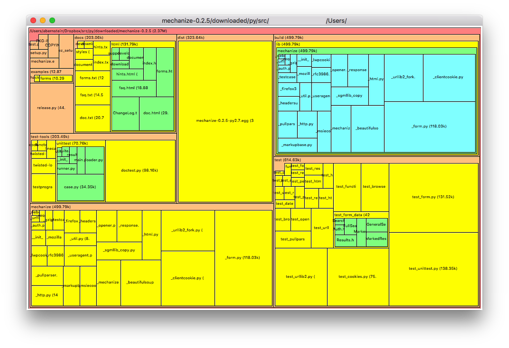

# what

treemonger is a disk space usage visualizer, inspired by the old version of [spacemonger](https://www.stardock.com/products/spacemonger/)

I like spacemonger because of a few details of its treemap rendering method, all of which contribute to considerably better "readability" than every other related tool I have tried.

- it uses the [squarify](https://www.win.tue.nl/~vanwijk/stm.pdf) subdivision rules (or similar),
- it shows the directory hierarchy with thin but nonzero margins,
- it does *not* use "cushion" or "profile" gradients, but rather color for depth, and filename labels for maximum *glanceable* information,
- it displays directory labels, at the cost of a bit of accuracy in relative sizing (IMO sizing in this sort of tool is mainly useful for ranking, rather than fine comparison, so the loss of accuracy isn't a problem).

The main motivation for treemonger is to replicate this treemap method. Unlike spacemonger, It is intended to work on Linux and Mac, in addition to Windows.

treemonger is a GUI app out of necessity; TUI tools like [ncdu](https://dev.yorhel.nl/ncdu) also have their place, but the pixel-level effect I'm looking for requires a canvas.

In lieu of a fully-featured GUI, the app window is just a canvas. UI actions are accessible via simple keystrokes and mouse buttons.

example:


# install

```
pip install -r requirements.txt
```

one hard requirement:
- tkinter

can be used if available:
- pyperclip (clipboard functionality)
- magic (additional file details)


# run

```
./treemonger.py                                 # run in current directory
./treemonger.py ~/Downloads                     # specify directory
./treemonger.py --file="/path/to/archive-file"  # display previously archived scan
./treemonger.py --file                          # display most recent archived scan
./treemonger.py --skip-mount                    # try to avoid scanning things like network drives
./treemonger.py --exclude-dir="foo"             # can be repeated
./treemonger.py --exclude-file="bar"            # can be repeated
./treemonger.py --exclude-filter="regex"        # can be repeated
```

Default values for certain flags can be defined via the configuration file.

# config

treemonger looks for a local configuration file at `~/.config/treemonger.json`.
If that file is not found, it uses the default `config.json` file included in the repository.

Values in the config file are replaced or extended (for list-valued flags) by any supplied command-line flags.

Config sections include:

- flags: basic program behavior flags
- mouse: UI mouse event definitions
- keyboard: UI keyboard event definitions
- tk_renderer: low-level rendering parameters; adjust these at your own risk
- colormap (not yet implemented)

# UI

UI actions are customizable, with default configuration:

- mouse<1>: `info` (left click in ubuntu)
- mouse<2>: `copy_path` (middle click in ubuntu)
- mouse<3>: `delete_file` (right click in ubuntu)
- mouse<4>: `zoom_out` (wheel up in ubuntu)
- mouse<5>: `zoom_in` (wheel down in ubuntu)
- "Down": `zoom_in` (down arrow)
- "Up": `zoom_out` (up arrow)
- "c": `copy_path`
- "d": `delete_file` ($${\color{red}WORK IN PROGRESS, USE AT YOUR OWN RISK}$$)
- "i": `info`
- "m": `cycle_mode` (not yet implemented)
- "o": `open_location`
- "q": `quit`
- "r": `refresh`
- "t": `zoom_top`

Actions are simple member functions in renderers/tk.py:TreemongerApp.

(Mouse button mapping in tk is platform-dependent. Rather than try to interpret what they mean in a coherent way, I chose to make the interface fully customizable: update the config file to whatever works for you.)

# future work

- refactor things to enable delete/refresh to work properly
- fix glitchy rendering/clipping (probably requires a new rendering engine)
- different display/sizing modes
